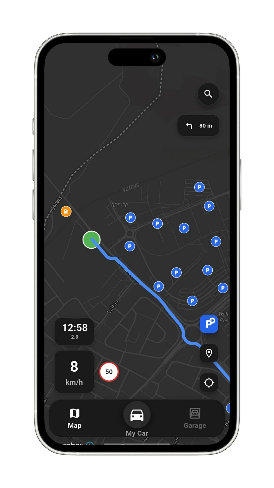
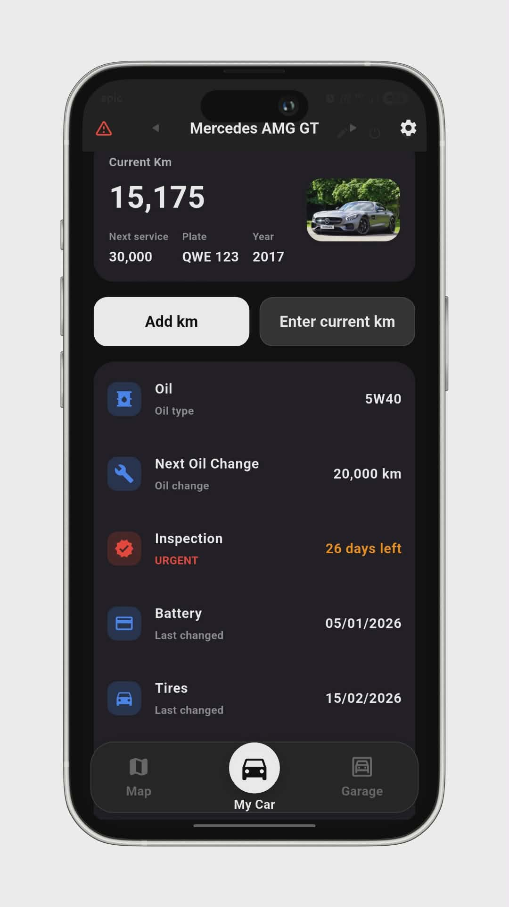
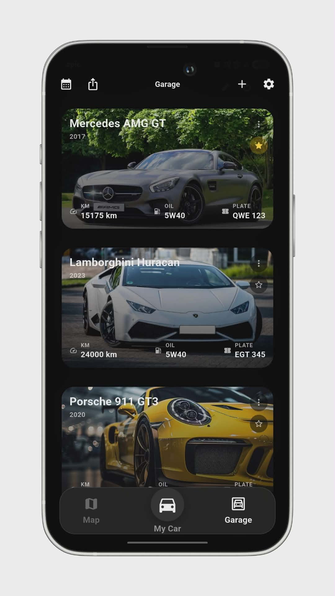
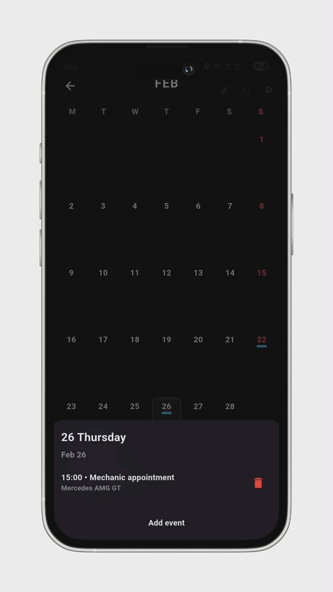
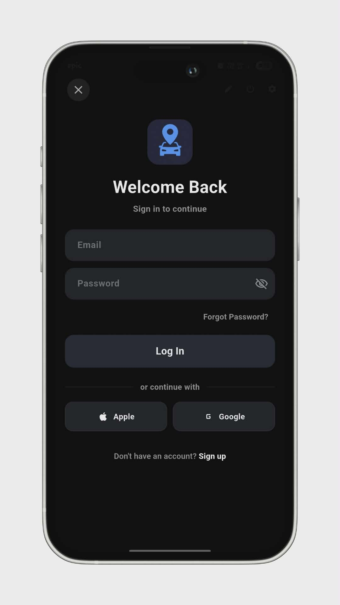
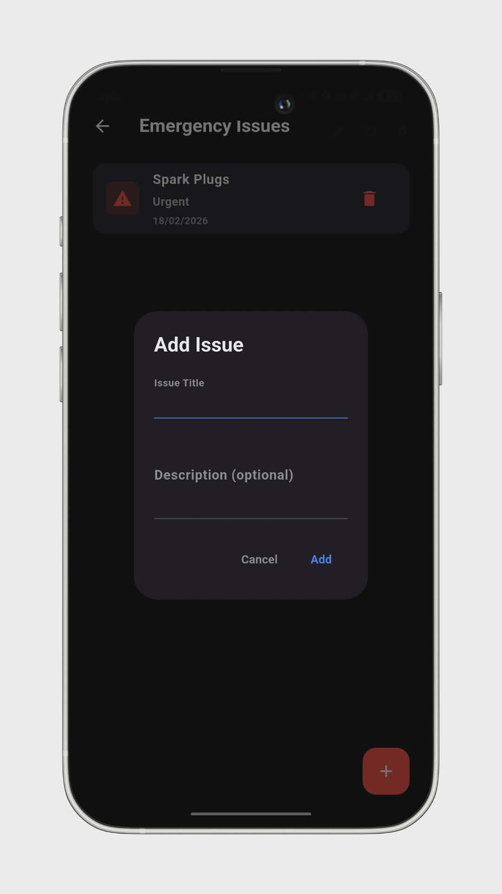

# DriveMap App

A modern mobile app designed to help drivers manage their cars, stay organized, and improve their driving experience — all in one place.

## Overview

DriveMap is an all-in-one application for car owners.  
It helps you keep track of your vehicle, manage important reminders, and quickly access useful information while on the road.

The goal of the app is to make car ownership **simpler, smarter, and more organized**.

## ✨ Features

### 🗺️ Smart Map
- Find nearby parking spots
- Locate gas stations around you
- Quick access directly from the map

### 🚗 Car Profile
- View your car's*specifications
- Track mods and upgrades
- Keep everything about your car in one place

### 🛠️ Maintenance Reminders
- Service notifications
- Oil change reminders
- Never forget important maintenance again

### 📅 Built-in Calendar
- Schedule mechanic appointments
- Receive notifications for upcoming events

### ⚠️ Emergency Issues
- Log and track car problems
- Keep notes for repairs and maintenance

### 🏠 Home Screen Widget
- Quick access to key information
- See important updates without opening the app

## 🛠️ Tech Stack
- Mobile Framework: Flutter
- Backend: Supabase
- Maps Integration with MapboxAPI
- Push Notifications

## 🚧 Status

The app is currently in development

New features and improvements are continuously being added based on user feedback and testing

## 📸 Screenshots

## 💡Feedback

Suggestions and ideas are always welcome.

If you have feedback or feature ideas, feel free to open an issue or reach out.

## 📄 License

This project is currently not open for redistribution.  
All rights reserved.

⭐ If you like the project, consider starring the repository!
